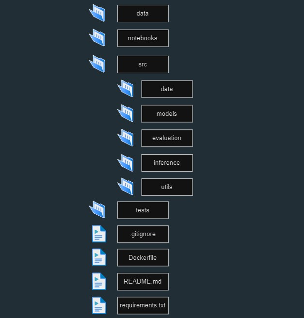

# MLOps Ground Zero

The best way to level up as a data scientist now is to upskill in MLOps, and the absolute easiest way to get started with MLOps is to build your data science projects with a code structure that follows MLOps best practices.

This looks something like this:



You're basically seperating out the compenents of everything you do inside a jupyter notebook inside .py files. There's a few benefits to doing it this way:

1. **Reproducibility**: makes it easier to trace and track everything so it's clear on how you can reproduce results if needed.
2. **Collaboration**: understanding the code base will be clear, which makes collaborating that much more efficient.
3. **Maintainability**: similarly, alongside clearer understanding comes an easier time to navigate and debug.
4. **Scalability**: once you're ready to go to production, having a structure codebase will make version control and CI/CD straightforward.

## Folder Breakdown

Now let's go over all of the folders. 

 - **data**: where you'll store all your raw and processed data
 - **notebooks**: where you'll put notebooks if you still want to use them for exploration, recommend following a naming convention like 01_data_collection
 - **src**: src stands for source code, and will contain folders for each step of a training pipeline
    - **data**: this folder is for data processing scripts. You'll load data, preprocess it, and then store that into the other data folder. Feel free to rename this to something else, like 'processing', so you don't have two 'data' folders
    - **models**: this is where you're training scripts will go, and you might want to add a models folder in the root repository to store your final model
    - **evaluation**: here you can write scripts to evaluate your trained model and save the evaluation metrics
    - **inference**: this is where you'll create inference scripts, to use the final model on unseen data
    - **utils**: this folder is for .py files that contain commonly used functions that, and typically has a file with a name like 'common.py' for them
 - **tests**: the tests folder is for your unit and/or integration tests
 - **.gitignore**: this is the standard file to add files you don't want git to track
 - **Dockerfile**: docker is something you can use to ensure consistency across different environments
 - **requirements.txt**: this file you'll need for the Dockerfile if you use it, but it's good practice to always have this anyway since package versions are often the root of random errors

 Now that we've gone over this code structure, let's look at a nice way to automatically setup your repository to follow these MLOps best practices. The way this works is you should create a file called template.py, and paste the below code into it. Then just run it.


```python
import os
from pathlib import Path
import logging

logging.basicConfig(level=logging.INFO, format='[%(asctime)s]: %(message)s:')

project_name = "mlops_ground_zero"

list_of_files = [
    "data/.gitkeep",
    "notebooks/.gitkeep",
    "src/data/.gitkeep",
    "src/models/.gitkeep",
    "src/evaluation/.gitkeep",
    "src/inference/.gitkeep",
    "src/utils/.gitkeep",
    "tests/.gitkeep",
    ".gitignore",
    "README.md",
    "Dockerfile",
    "requirements.txt"
]

for filepath in list_of_files:
    filepath = Path(filepath)
    filedir, filename = os.path.split(filepath)

    if filedir !="":
        os.makedirs(filedir, exist_ok=True)
        logging.info(f"Creating directory; {filedir} for the file: {filename}")

    if (not os.path.exists(filepath)) or (os.path.getsize(filepath) == 0):
        with open(filepath, "w") as f:
            pass
            logging.info(f"Creating empty file: {filepath}")
    else:
        logging.info(f"{filename} already exists")
```

The way it works is you define your path files according to the code structure above, and then iteratively go through each file and check if it exists. If it does, then do nothing, otherwise create the folder. Unfortunately, we can't create empty folders like this, as GitHub won't track them, but by adding .gitkeep files to each folder you can get around this (.gitkeep tells GitHub to track the folder regardless).

And that's it - simplest and most straightforward way to keep MLOps in mind. You might want to make some small adjustments to the repository structure, but the important thing is to follow a structure like this, rather than staying a a few Jupyter Notebooks. Also, there's much more to this of course - most important thing not covered here is probably tracking model training experiments, for which I'd recommend looking into mlflow as that's the standard and easiest thing to implement next.
